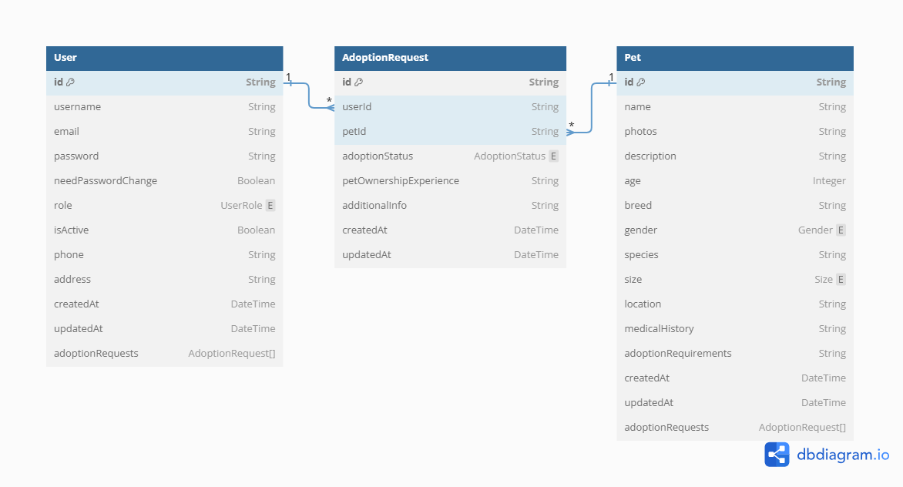

# Pet Adoption Server

#### [API Live Link]()

## Project Setup

1. Install dependencies and Run the server:

   ```bash
   # 1. Clone the Repository
   git clone
   # 2. Navigate to the project directory
   cd pet-adoption-server
   # 3. Install Dependencies
   yarn add
   # 4. Run the server
   yarn dev
   ```

1. Setup environment variables:

   ```js
   NODE_ENV = development;
   PORT = 5000;
   DATABASE_URL = your_postgres_url;
   BCRYPT_SALT_ROUNDS = your_bcrypt_salt_rounds;
   JWT_SECRET = your_jwt_secret;
   JWT_EXPIRES_IN = your_jwt_expires_in;
   REFRESH_JWT_SECRET = your_refresh_jwt_secret;
   REFRESH_JWT_EXPIRES_IN = your_refresh_jwt_expires_in;
   CLOUDINARY_CLOUD_NAME = your_cloudinary_cloud_name;
   CLOUDINARY_API_KEY = your_cloudinary_api_key;
   CLOUDINARY_API_SECRET = your_cloudinary_api_secret;
   ```

## Technology Stack

- **Programming Language:** TypeScript
- **Web Framework:** Express.js
- **ORM:** Prisma with PostgreSQL
- **Authentication:** JWT (JSON Web Tokens)
- **Validation:** Zod

## Features

1. User Registration
2. User Login
3. Add a Pet
4. Get Paginated and Filtered Pets
5. Update Pet profile
6. Submit Adoption Request
7. Get Adoption Requests
8. Update Adoption Request Status
9. Get User Information
10. Update User Information

## API Documentation

[Postman API Documentation Live Link]()

## Entity Relationship Diagram


